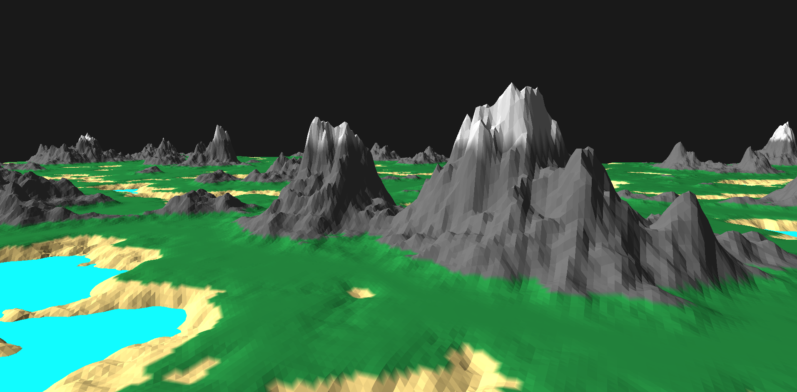

# Procedural Terrain Generator

An OpenGL 3.3 and C++ program that generates unique landscapes using [Perlin Noise](https://en.wikipedia.org/wiki/Perlin_noise).



## Building

To build, you must have [CMake](https://cmake.org/) installed.
Start by cloning the repository and creating a folder named build:

```bash
git clone https://github.com/piigle/procedural-terrain.git --recursive
cd procedural-terrain
mkdir build
cd build
```

If you are on Linux, you will have to install some dependencies:

```bash
sudo apt install mesa-utils libglu1-mesa-dev freeglut3-dev mesa-common-dev libglew-dev libglfw3-dev libglm-dev libao-dev libmpg123-dev
# for X11 I found that I needed to install the following
sudo apt install libxinerama-dev libxcursor-dev libxi-dev
```

Select your generator and build, for Windows I usually use `"Visual Studio 17 2022"` or `"MinGW Makefiles"`, as for Linux, I use `"Unix Makfiles"`.

```bash
cmake -G "Unix Makefiles" .
cmake --build .
```

Make sure that you run the executable from the root of the project or else the shaders and assets will fail to load.

Contact me if you have any questions or trouble concerning the build process.

## Libraries

- [glfw](https://github.com/glfw/glfw) - for window management and input handling
- [glad](https://glad.dav1d.de/) - for loading OpenGL functions
- [glm](https://github.com/g-truc/glm) - for linear algebra
- [stb_image](https://github.com/nothings/stb/blob/master/stb_image.h) - for image loading
- [imgui](https://github.com/ocornut/imgui) - for GUI
- [FastNoiseLite](https://github.com/Auburn/FastNoiseLite) - for the GLSL implementation of Perlin Noise
